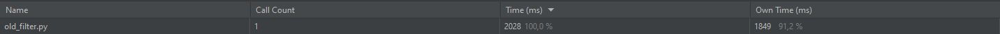

# AT-07_Python
26.11.2021

Разница во времени выполнения filter.py и oldfilter.py связана со временем,  
которое тратится на ввод данных

А filter_with_filename.py выполняется быстрее чем oldfilter.py, так как вместо  
ручных циклов используются матричные преобразования такие как:

<code>img_pixels[height: RightHeight, width: RightWidth] = \ 
        [averageCol // Grey * Grey] * 3</code>

<code>averageCol = int(np.average(np.average(img_pixels[height: RightHeight, width: RightWidth])))</code>

